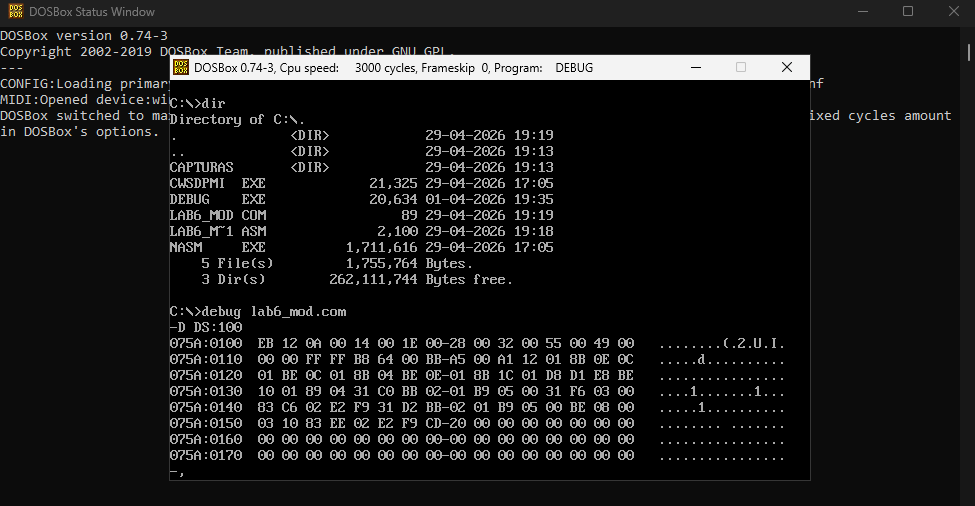
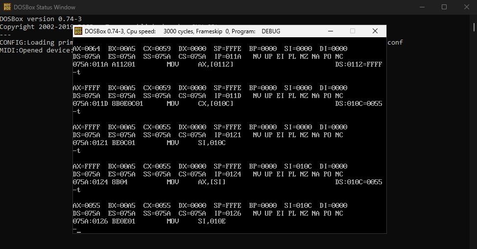
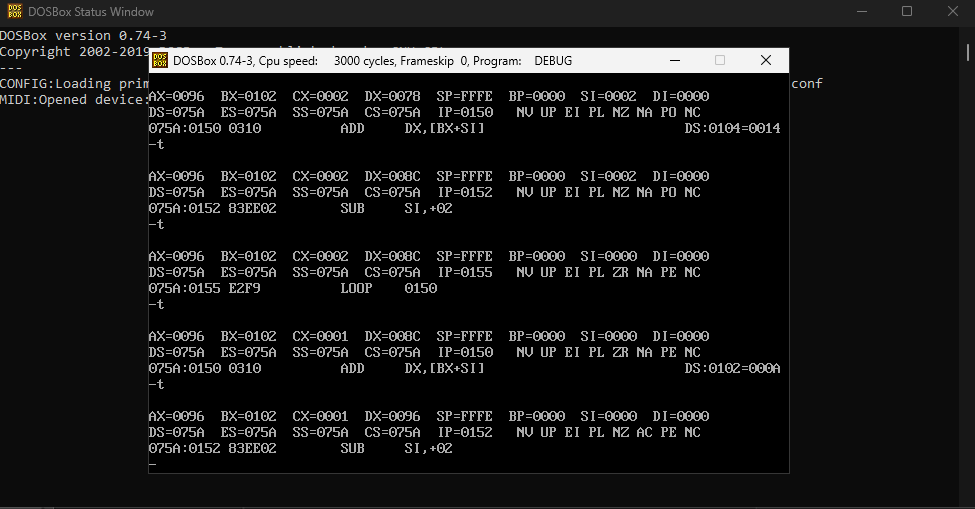

# Arquitectura de Computadores - Unidad 6: Post-Contenido 2

## Datos del Estudiante
* **Nombre:** Obed Ayala
* **Institución:** Universidad Francisco de Paula Santander (UFPS)
* **Programa:** Ingeniería de Sistemas
* **Año:** 2026

## Análisis de Modos de Direccionamiento
En este laboratorio se implementaron y verificaron cuatro modos de direccionamiento fundamentales de la arquitectura x86. El programa utiliza una estructura de datos compuesta por un array de 5 enteros y un registro de notas para demostrar la flexibilidad en el acceso a la memoria.

### Tabla Resumen de Modos
| Nombre del Modo | Fórmula de Dirección Efectiva ($EA$) | Instrucción NASM Usada | Valor Observado en DEBUG |
| :--- | :--- | :--- | :--- |
| **Inmediato** | El dato es parte del opcode | `MOV AX, 100` | `AX = 0064h` |
| **Directo** | $EA = \text{Desplazamiento Fijo}$ | `MOV AX, [var_x]` | `AX = FFFFh` |
| **Indirecto** | $EA = [SI] \text{ o } [BX]$ | `MOV AX, [SI]` | `AX = 0055h` (85) |
| **Indexado** | $EA = Base + Índice + Desp$ | `ADD AX, [BX + SI]` | `AX = 0096h` (150) |

---

## Resultados y Verificación (Checkpoints)

### Checkpoint 1: Estructura de Memoria y Little-Endian
Se verificó la carga de datos en memoria mediante el comando `D DS:100`. Se observó que los valores se almacenan bajo la convención **Little-Endian**, donde el byte menos significativo se guarda en la dirección más baja. 
* **Ejemplo:** El valor 10 decimal ($000Ah$) se observa como `0A 00`.

### Checkpoint 2: Trazado del Modo Indirecto
Se utilizó el comando `T` para seguir el flujo de los punteros. Se documentó el cambio en el registro **SI** para acceder a diferentes campos del registro de estudiante.

| Instrucción | Registro Modificado | Valor Resultante |
| :--- | :--- | :--- |
| `MOV SI, 010A` | SI (Puntero a `notal`) | `010A` |
| `MOV AX, [SI]` | AX (Carga `notal`) | `0055h` (85) |
| `MOV SI, 010C` | SI (Puntero a `nota2`) | `010C` |
| `MOV BX, [SI]` | BX (Carga `nota2`) | `0049h` (73) |
| `MOV [SI], AX` | Memoria (Guarda promedio) | `004Fh` (79) |

### Checkpoint 3: Modo Indexado y Recorrido Inverso
Se implementó un bucle para sumar los elementos del array. Al finalizar, el registro **AX** mostró el valor **0096h** (150 decimal). Como extensión, se implementó un segundo bucle que recorre el array en orden inverso (del índice 4 al 0) utilizando `SUB SI, 2`, obteniendo el mismo resultado de suma acumulada.

---

## Conclusiones Técnicas
1. **Eficiencia del Modo Inmediato:** Es el modo más rápido de ejecución ya que el operando se obtiene durante la fase de búsqueda de la instrucción, eliminando ciclos de lectura de memoria de datos.
2. **Potencia del Modo Indexado:** Este modo es esencial para la manipulación de arreglos y estructuras complejas, permitiendo que un registro base apunte al inicio de la estructura mientras un índice se desplaza dinámicamente entre los elementos.
3. **Little-Endian:** La inspección con DEBUG fue clave para comprender que, aunque nosotros vemos los valores de 16 bits de forma natural, el procesador los descompone físicamente en memoria invirtiendo el orden de sus bytes.

